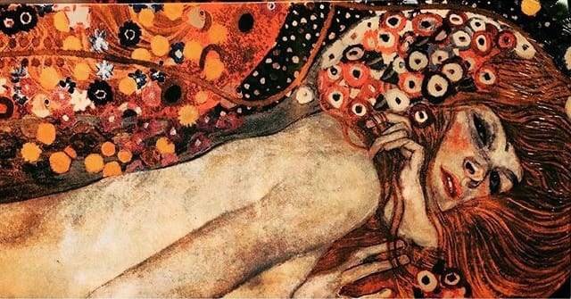

# Gustav

Nedostajale su mu reči. Nije hteo da joj govori tim običnim, za njega bezbojnim, frazama. Ne, Gustav je tražio posebne, nove reči. Kojima je želeo da je definiše, da uhvati, da shvati: jednostavnu lepotu njenog osmeha, slap nemirne kose koji se blista na suncu i jesen u njenom pogledu. Tražio je reč, ali ne više jednu, već sazvučje. Akord glasova koji će dati njene boje. Vreme je prolazilo, a Gustav je sve manje pričao. Slikao je, zato, punim bojama i zlatnim nitima. Do dana kada je prestao. Iza njega je ostala ona na platnu, naslikana rečima.