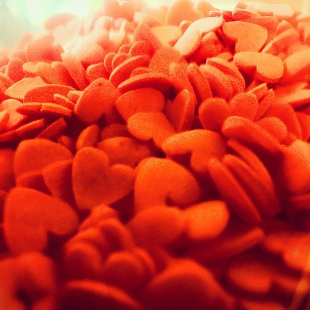

# Slučaj srca

Zet gospodina Marića je odlučio da prestane da je voli, jer je previše jako. Odlučio je da zdrobi svoje srce, jednom zauvek. I to je uradio, jednog jesenjeg popodneva, naročito sunčanog, i pomalo hladnog. I gle! Šta se dogodilo? Srce se nije dalo polomiti, već se raspalo na 2020 manjih srdaca, svako podjednako jako. Zet gospodina Marića je gledao u neverici, a onda se osmehnuo:

> "L’Amour est la quintessence de la vie."

A šta drugo.
