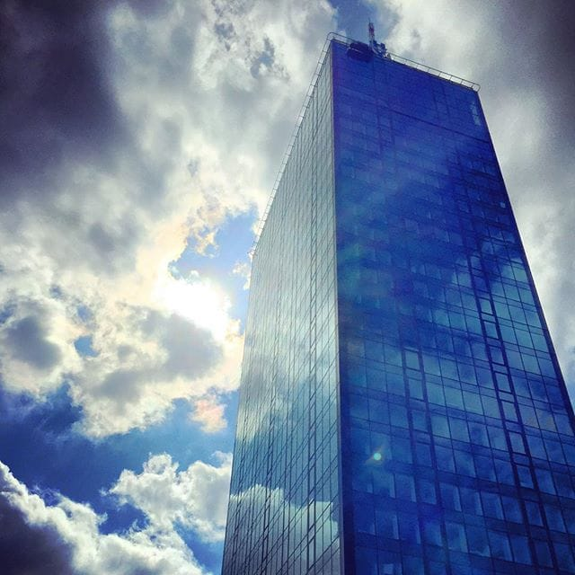

# Na Vrhu

Ona je radila na četvrtom, a on na dvanaestom spratu. Išli su različitim liftovima. Njoj je posao počinjao u osam, a njemu tek posle devet sati. Za ručak su, sasvim slučajno, odlazili u različite okolne restorane. Nisu imali ni jednog zajedničkog poznanika. Kancelarije su im gledale na različite strane, pa nikada nisu uživali u istom pogledu. Oni to još ne znaju, ali postoji jedna stvar koja im je zajednička. To je vrh zgrade u kojoj rade. Tu će se upoznati. Na vrhu. Sve će dobiti svrhu.