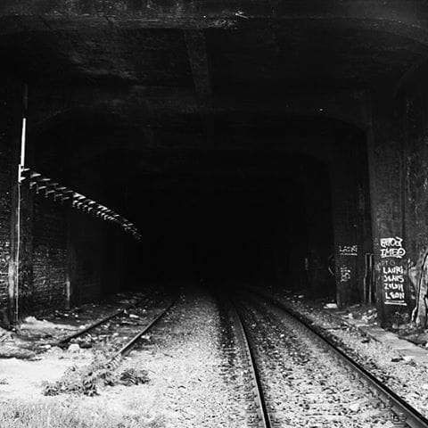

# Nemogućnosti

Nemogućnost. Nije nam dato da budemo ono šta želimo. Kako trajemo, tako nas nemogućnost sve više zatvara. Podseća na ulazak u duboki tunel: i dalje postojiš, dišeš; ali kuda god se okreneš nema svrhe. Čudno, vreme se izvije i brže se trošiš, što dalje odeš. I sad ti tu kao žmuriš, da bi se činilo da je mrak u stvari samo tu dok su kapci spušteni. Otvori oči.