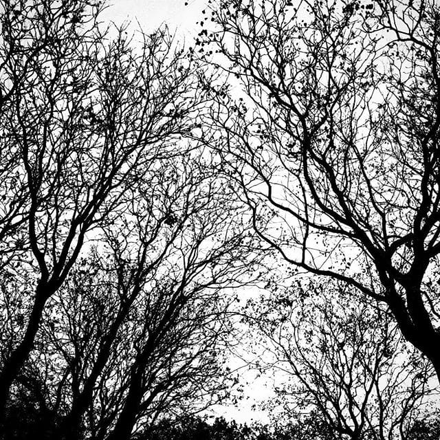

# Pukotina neba

Jednom se nebo spustilo baš nisko, niže nego inače. Ljudi nisu ništa primećivali, za njih je to bio tek još jedan dan. Pratilo je nebo sve šta se događa, pomno. A onda je igrom slučaja koja uključuje jedan list, vetar i dodir dlana, nebo zapelo za krošnje i poderalo se. Pukotina se širila i granala haotično, poput istog tog golog stabla koje ga je iscepalo. Slučajni prolaznik nije primetio ništa, to je bila samo još jedna krošnja. Osim što je bila kraj neba.