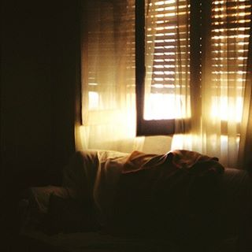

# Prozori

Sećao se još dugo tih prozora. Roletne su često bile navučene na pola, a u naročito doba dana su punile sobicu tačkama svetla i lenjim senkama. Ležali su ponekada ispod tih prozora, kao sklopljene slagalice, prkoseći besmislu. Sada kada neko drugi tu živi, voli da zamišlja kako se njen i njegov lik ocrtavaju u staklu, jedva primetno, odražavajući jednostavnost postojanja kojom su se halapljivo koristili.
