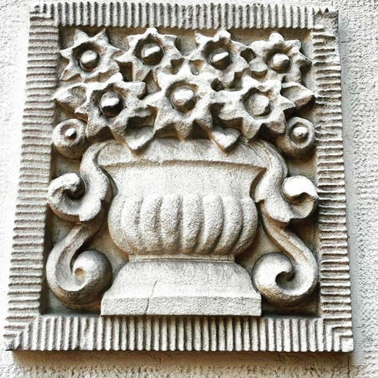

# Baka Rosa

Živela u Beogradu jedna magična baka, baka Rosa. Imala je moć da ispunjava želje. Tražila je zauzvrat da joj se pokloni cvet. Onda bi tražila da proveri želju, jer samo prave želje smeju da se ispune. Želja mora biti toliko jaka da može da pretvori doneseni cvet u kamen. Zapravo, baka Rosa i nije mogla da ispunjava želje - njoj su bile potrebne iz drugog razloga. Ceo svoj život je tražila nekoga čija je želja jača od njene, pradavne želje koju je nosila skoro pa ceo život u sebi. I tako se baka Rosa hranila tuđim željama... Sve dok jednog dana ona nije naprečac nestala. Ostao je samo kameni buket u njenom stanu. Da li je našla jaču želju? Da li ju je našao predmet njene želje, posle toliko vremena? Ostala je misterija....
