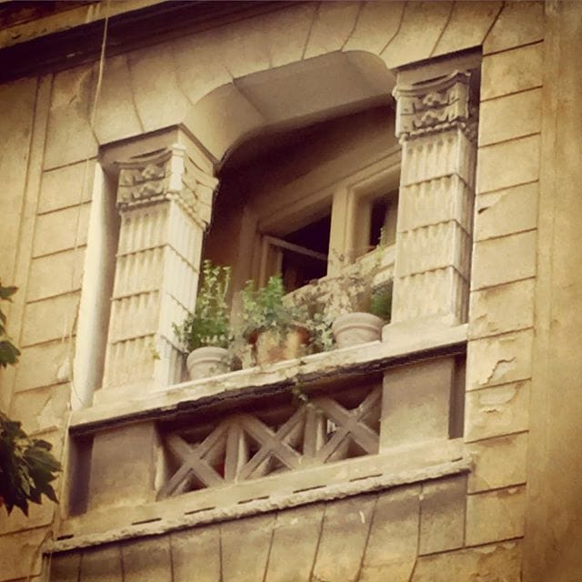

# BGD Romeo

Romeo je živeo u Hilandarskoj. Imao je gajbu koju su mu roditelji poklonili za punoletstvo. Gajba je imala i jedan balkon. Tu je znao da sedi do ranog jutra, naročito posle burnih izlazaka. To ga je smirivalo. Sve dok jednog jutra nije video Mariju. Marija je živela na kraju linije 706 i tog jutra je žurila na posao. Da li je u pitanju piće ili neki neobičan zrak sunca, tek Romeu se dopadne Marija. Spusti se niz terasu do zadivljene Marije i predstavio joj se. Ona je odmah pala na njega. I on u nju. Sve dok na jednoj žurci nije upoznao Marijinu polu-sestru Juliju, gradsku ribu, u toaletu, gde su razmenili više od pogleda.
