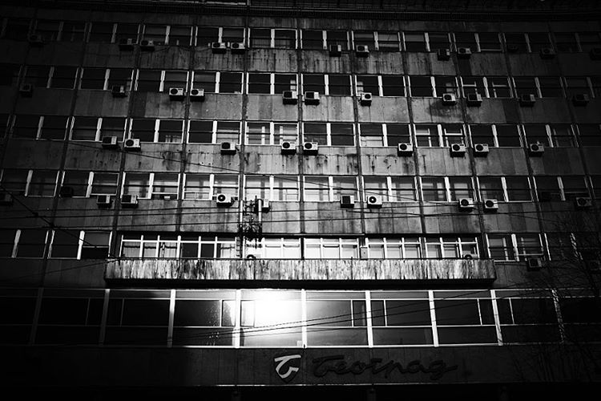

# Noć

Noć je poput zgrade, masivne, stare, hladne; sa beskonačno hodnika i bezbroj vrata iza kojih se percepcije menjaju i poimanja potiru; s prozorima koji gledaju ka unutra i zidovima koji neprestano menjaju položaj; znaš da moraš ući jednom, ili svaki dan, i negde na rubu svesnog treperi strah da ne pronađeš izlaz. Idem da spavam, sada; noć mi otvara vrata.
