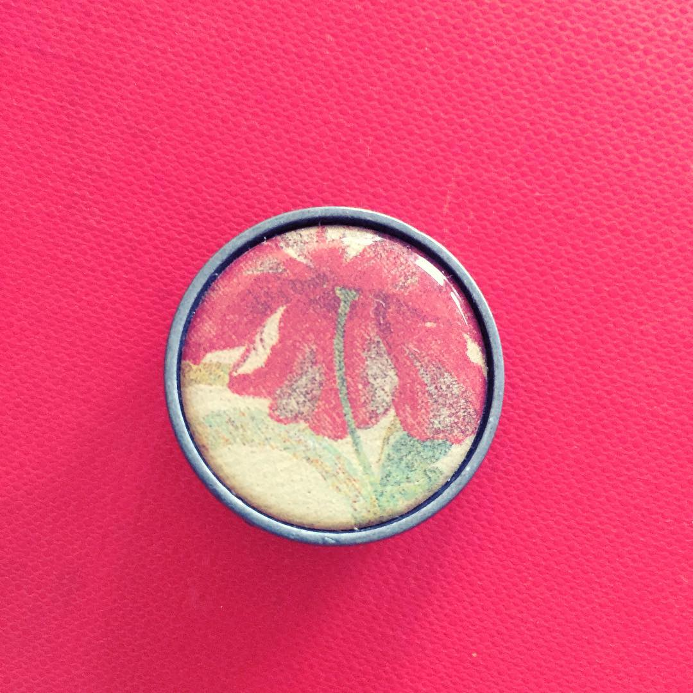

# Dugme

Ovo je dugme sa letnjeg žaketa mlade Katarine Jovanović, otpalo tokom šetnje Kosančićevim vencom, toplog avgusta 1897. Tako je bar rekla svojim, uvek strogim roditeljima. Istina je da je ono ostalo u prstima nepoznatog mladića, s kojim se Katarina te večeri neobuzdano ljubila ispod napuklih krošnji, sakriveni u nemirne senke daleko od kaldrme. To je bila nemoguća ljubav, Katarina je to dobro znala; zato je tako mirisala na opojnu jesen koja tek što se nije pustila u Beograd. Koliko traje poljubac? Koliko traju senke? Tek, odjednom, Katarina se otrgla, i potrčala neravnom kaldrmom, između uspavanih fijakera i dokonih starica, grizući usne još vrele od poljubaca. On ju je pokušao zadržati, međutim, iscurela je među prstima, i sve što je ostalo je bilo ovo dugme. Katarina nikada nije oprostila sebi što je ostala bez dugmeta, a on nikada nije oprostio sebi što je dugme bili sve što je ostalo.

Šta je dalje bilo, dugme nije znalo da mi kaže.

Jednog letnjeg podneva, više  od stotinu godina kasnije, dugme me je pronašlo i ispričalo ovu priču.
