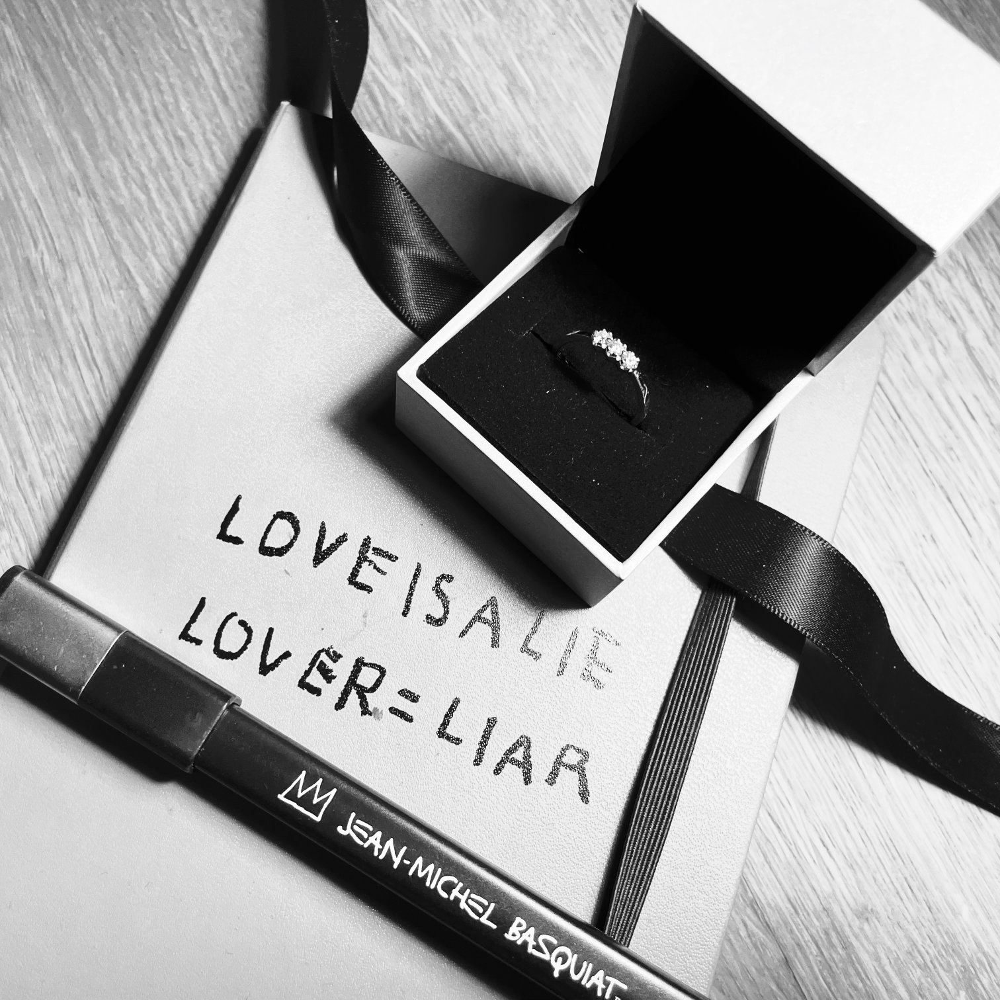

# Oglas

Poklanjam jedan prsten.

Voleo sam je.
Maštao sam
o njenim
nedeljama,
tišinama,
daljinama,
prstima i
usnama.

Ali istrošila se.
Iskrzala.
Ispucala
po krajevima.
Pokidala kao
list papira.
Ta ljubav koja
nije
preostala.

Drugde negde je
otišla.

Volim je.
Onako kako je
nemoguće
voleti nekoga
koga više
nema.

Prsten
nije na prodaju.
Traži novi
početak.
Poklanjam ga
onima koji
drznu
da se vole
do kraja.
Znaćete šta
vam je
činiti.
