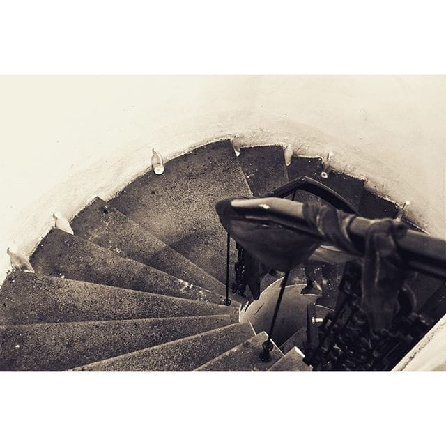

# Ideš dole?

Dođi dole. Ko si ti? Dozvoli da se predstavim... Znam ko si. Tako je. Šta je dole? Kraj, šta drugo. Srećan kraj? Ne znam, kraj je samo kraj, vi ljudi ste ti koji tražite sreću, ne ja. Ako siđem, da li dobijam nešto? Ha, toga ima samo u knjigama, ne, naravno. Zašto onda? Jer tražiš. Da li boli? Samo dok silaziš. Nije daleko... Nije, idemo? Da.

Drži me za ruku, malena.
