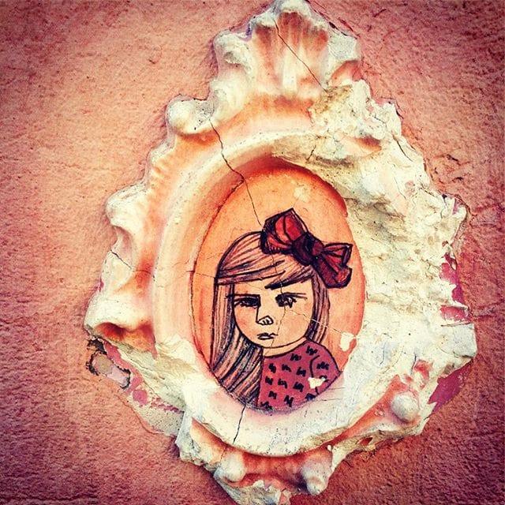

# Jelena

Priča se da nije bilo lepše od Jelene, ali niko nije bio u stanju da objasni
šta je to čini lepom. Svaki deo njene lepote gledano za sebe je bio tek obično lep. Međutim, na Jeleni se sve spajalo u jednu vanvremensku lepotu koja nije jenjavala. A osmeh tek... Ali ovo nije priča o njenoj lepoti. Jelena je vrlo brzo zamrzela površnu lepotu koju je nosila; počela je da se odeva neugledno, da namerno prkosi stavovima i da se buni sa i bez razloga. Tražila je da ljudi se oslobode time što će potražiti sebe u sebi, a ne u drugima. Znala je da prolaznicima deli nakaradne crteže sebe, koje je bojila do duboko u noć. I jedan takav crtež se odmetnuo i usudio da ukrasi fasadu zgrade blizu mesta na kome je često boravila.

Kažu da je od tada nisu videli, bila je žena koje nema, osim što je svojim izvitoperenim likom podsećala prolaznike na sebe. Bar one koji su je tražili.