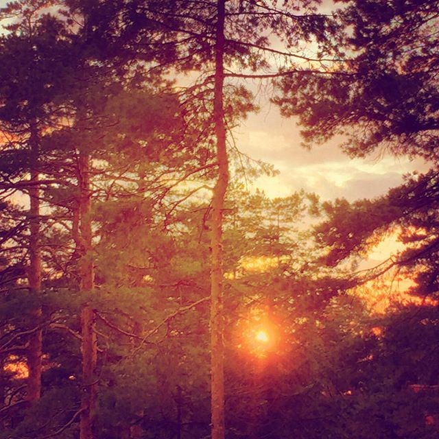

Zastao je da predahne. Osvrnuo se, smiraj je dana. Leto je bilo gotovo. Osetio je to, odjednom. Pogledao je svoje ruke, i sve što je ostalo u letu koje je prošlo. Prkosna rabaškarenost izobilja... Da, leto se završilo. Uz poslednje zrake sunca, krenuo je dalje. Staza ga je pratila u jesen.
