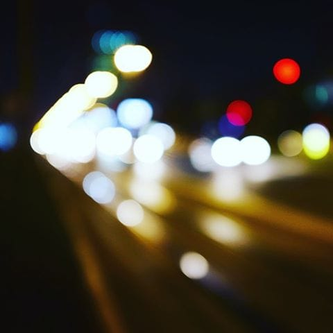

# Petak

Petak je počeo ranije, u četvrtak uveče. Ulice su bile prazne, bez očekivanja. Svetla su dobila pun sjaj u noći. Pravili smo senke i hodali četvrtkom bez cilja. Svetla prozora su se palila i gasila, neki drugi ljudi su odlazili na spavanje.
Petak je.