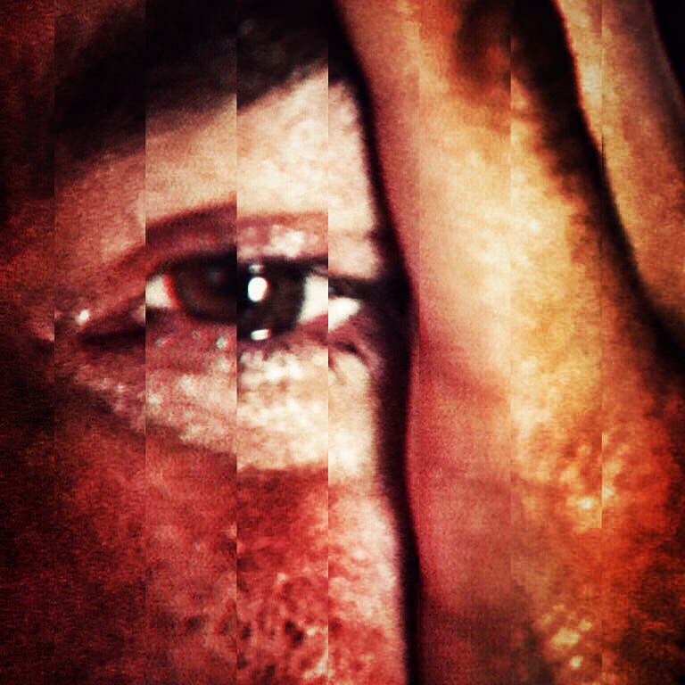

# Slom očiju

~~mrzim mrzim mrzim svakoga ko krade vreme s tobom i gleda te i voli te i priča s tobom i mami ti osmehe i s kim deliš ulice i kradeš noć i kratke suknje i crvene cipele i piće i sve koji dišu s tobom oko tebe i udišu kišu koja pada i sve one koji su bili nešto nekada i nikada i sve koji znaju sve šta ne znam i mrzim mrzim mrzim sve koji čekaju tramvaj na tvojoj stanici i prodavce sa pijace i konobare i mačke i zidove kojima odjekuješ i mrzim svakog ko te gleda dok spavaš i mrzim ove prste moje koje hvataju se za tamu, a u tami je samo praznina, mrzim ove grudi što udišu noć koja nije noć jer nema kraja, mrzim ove oči koje su večito gladne i traže te u svemu, u odrazu kafe, oblacima, kaučima, pokrivačima i zvukovima, mrzim ovu upornu strast strast strast strast za postojanjem smislom bolom prazninom i punoćom i boje koje boje sve jer jesu sve volim volim volim~~

~~kamo sreće da te ne volim, rekao sam zidovima. tužan sam. ne mogu ti reći koliko sam tužan, rekao sam zidovima. oni samo ćute, slegnu ramenima i postanu mrak.~~

~~nekada reči nisu dovoljne~~

~~slamaju se oči ove suzama~~

~~otići u kraj i nije tako teško~~
