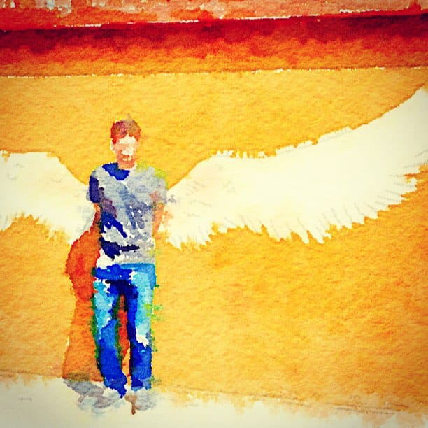

# Anđeo

Anđeo je imao obučene farmerke i običnu majicu. Čekao je u redu za kafu, pravu, ne onu ispranu, američku. Pio je polako, s uživanjem. Potom je ustao, obrisao usta i izašao napolje. Buka automobila i prašina velegrada.

Razvio je krila i poleteo. U gradu anđela.