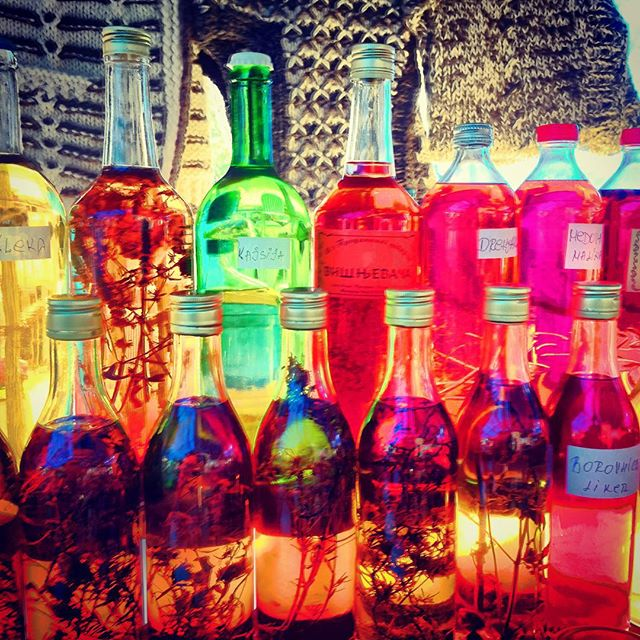

# Poslednji dan leta

Poslednjeg dana leta, sunce sija na poseban način.

Kažu da ga možeš uhvatiti ukoliko imaš tajnu koju si čuvao celo leto. Onda pustiš jutarnje zrake kroz staklo i vodu i, ubrzo, voda će promeniti boju.

Kakva je tajna, takva će biti i boja.
