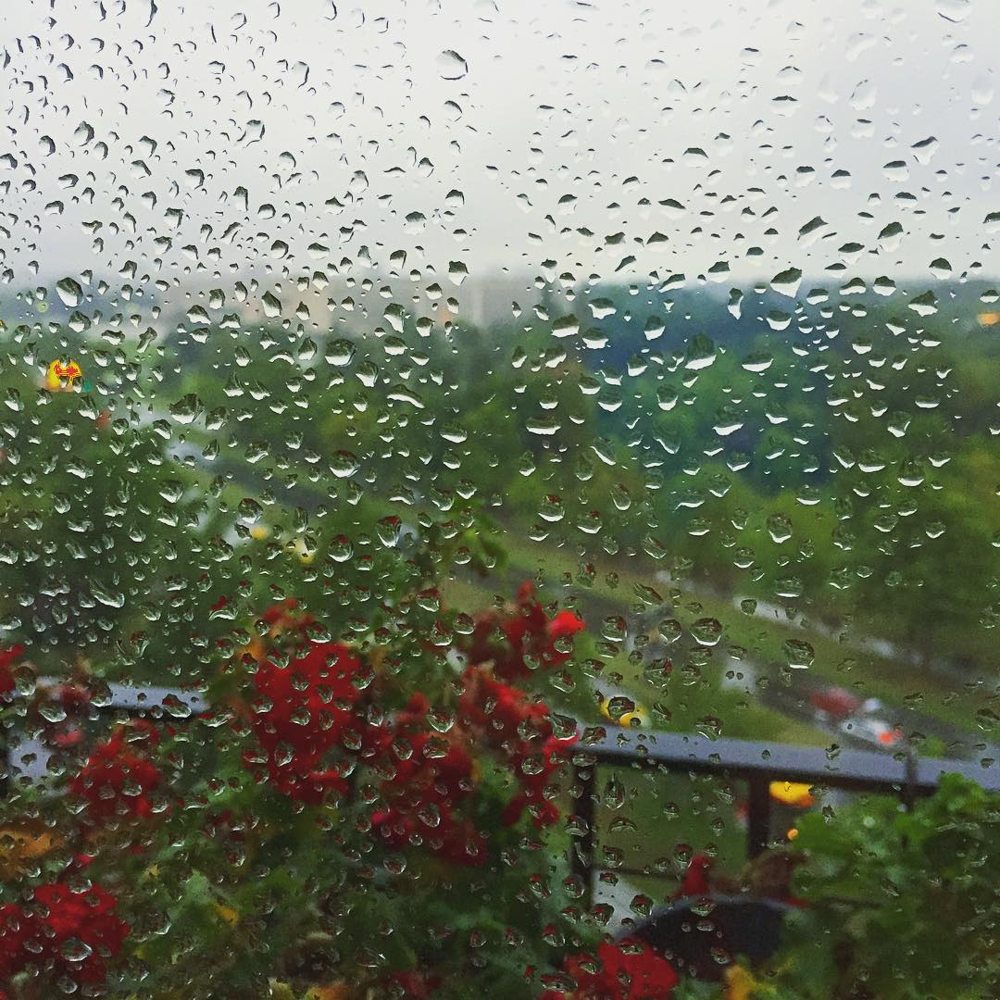

# Nevreme ujutru

Jutro je danas počelo ranije. Probudilo ga je nevreme, u pravo vreme. Baš kada je i jutro otvorilo oči, jedan neko se probudio u ovom gradu. Bilo je prerano da ustane, ali prekasno da se vrati snovima. Sve što je mogao je bilo da širom otvori prozore i pusti je unutra. Jutro, oluju ili nju?